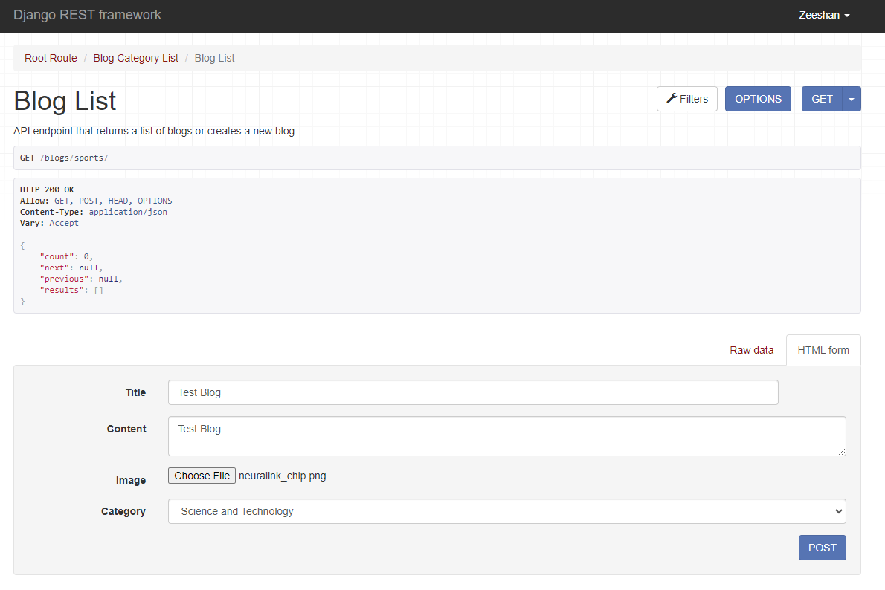
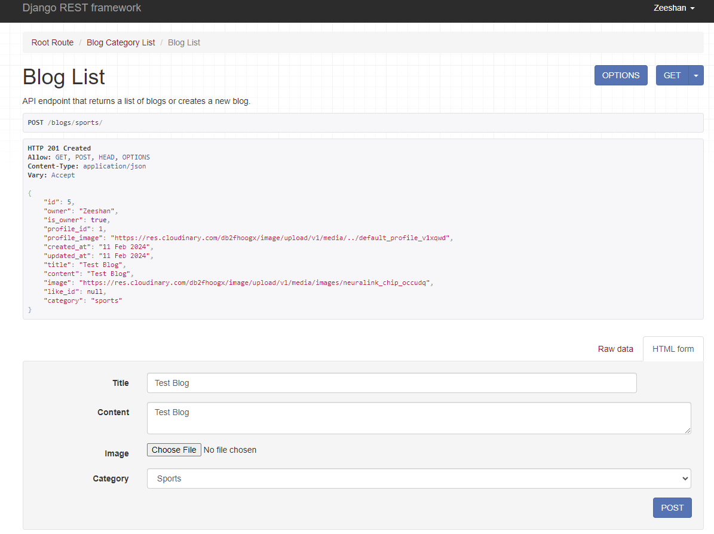
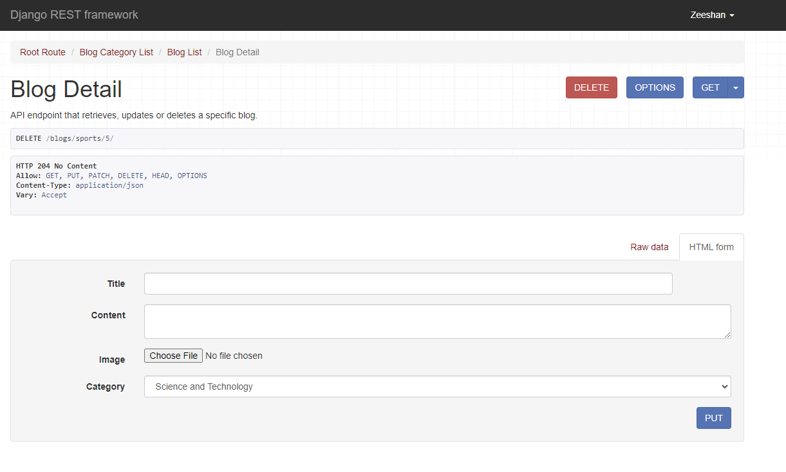
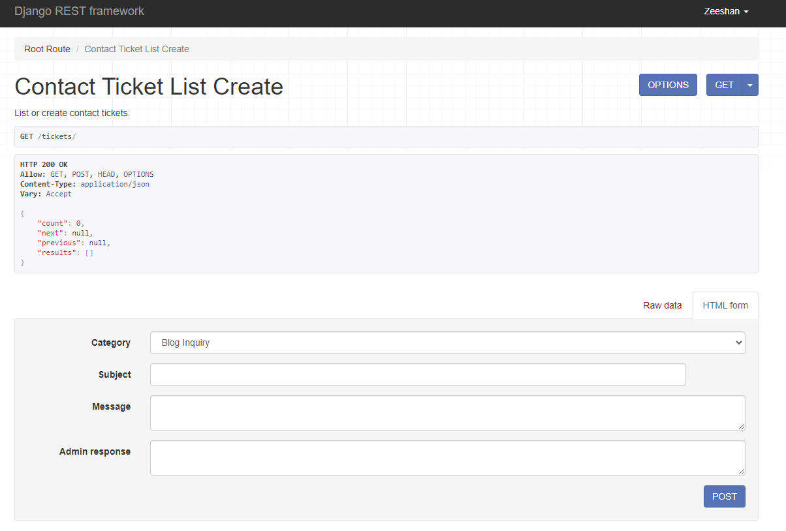
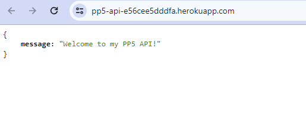

# API for Blogify: A Dynamic Blogging Platform with Django REST Framework

Developer: Zeeshan Shah

This repository contains the API set up using Django REST Framework for the Blogify front-end application.

## Table of Contents
  - [User Stories](#user-stories)
  - [Technologies Used](#technologies-used)
  - [Database](#database)  
  - [Validation](#validation)
  - [Testing](#testing)
  - [Credits](#credits)

## User Stories

### User Management

1. As a site owner/developer, I aim to empower visitors by providing them with the capability to effortlessly create their own accounts on the website.
2. As a site owner/developer, I endeavor to streamline the user experience by automatically generating profiles for authenticated users upon account creation.
3. As a site owner/developer, I strive to facilitate seamless access for registered users by enabling them to sign in to their accounts securely.

### Profile Management

1. As a site owner/developer, I aim to enrich user engagement by providing access to lists of profiles, offering users the opportunity to explore various registered profiles.
2. As a site owner/developer, I seek to enhance user interaction by enabling them to delve into individual profile details, fostering a deeper understanding of each profile.
3. As a site owner/developer, I endeavor to empower users to maintain control over their personal information by facilitating profile updates, allowing them to modify data as needed.

### Blog Management

1. As a site owner/developer, I aspire to encourage user-generated content by providing the ability for users to create and share blogs, fostering a sense of community and knowledge exchange.
2. As a site owner/developer, I aim to enhance user exploration by offering access to comprehensive lists of blogs, showcasing the diversity of content available on the platform.
3. As a site owner/developer, I endeavor to enrich the user experience by allowing users to delve into the specifics of individual blogs, enabling them to engage deeply with the content.
4. As a site owner/developer, I strive to empower blog owners with the flexibility to update their content as desired, ensuring the accuracy and relevance of their blogs over time.
5. As a site owner/developer, I aim to provide users with control over their content by enabling them to delete their blogs, respecting their ownership and preferences.

### Comment Management

1. As a site owner/developer, I aim to foster engagement and discussion by allowing users to view comprehensive lists of comments associated with blogs, facilitating interaction and feedback.
2. As a site owner/developer, I seek to empower comment authors with the ability to update their comments, ensuring accuracy and relevance in ongoing discussions.
3. As a site owner/developer, I aim to respect user autonomy by providing the option to delete comments, allowing users to manage their contributions as they see fit.

### Bookmarking

1. As a site owner/developer, I aim to enhance user experience by enabling users to bookmark blogs of interest for future reference and easy access.
2. As a site owner/developer, I strive to provide users with flexibility by allowing them to remove bookmarks from blogs they no longer wish to retain.

### Following

1. As a site owner/developer, I aim to offer users control over their content consumption by enabling them to unfollow profiles they are no longer interested in.

### Upcoming Blogs

1. As a site owner/developer, I aim to promote anticipation and engagement by allowing users to create upcoming blog entries, providing a preview of future content.
2. As a site owner/developer, I endeavor to maintain user excitement and interest by offering access to lists of upcoming blogs, encouraging users to revisit the platform upon publication.
3. As a site owner/developer, I strive to empower upcoming blog authors with the ability to edit and update their entries, ensuring accuracy and relevance.
4. As a site owner/developer, I respect author autonomy by providing the option to delete upcoming blog entries when necessary.
5. As a site owner/developer, I aim to maintain platform cleanliness by automatically removing upcoming blog entries that have passed their due dates.

### Contact

1. As a site owner/developer, I aim to facilitate communication and support by allowing users to create tickets for administrative inquiries or assistance.
2. As a site owner/developer, I aim to streamline ticket management by providing the capability to change ticket statuses as needed.
3. As a site owner/developer, I endeavor to provide timely and helpful responses to user tickets, ensuring a positive support experience.
4. As a site owner/developer, I strive to empower users with the ability to update their tickets, facilitating efficient communication and issue resolution.
5. As a site owner/developer, I respect user preferences and privacy by allowing them to delete their tickets when no longer needed.

## Technologies Used

### Languages & Frameworks

- Python 3.9.17
- Django Rest Framework

### Libraries & Tools

- [Cloudinary](https://cloudinary.com/): Utilized for efficient storage and management of images for both profiles and events.
- [CI Python Linter](https://pep8ci.herokuapp.com/): Employed for meticulous validation of Python files, ensuring adherence to PEP 8 standards.
- [Lucidcharts](https://lucid.app/): Leveraged to meticulously design and document the data model architecture, enhancing project clarity and organization.
- [Gitpod](https://gitpod.io): Serving as the Integrated Development Environment (IDE), it facilitated seamless code composition and integration with GitHub.
- [GitHub](https://github.com/): Acted as the primary remote repository for storing and managing project code, fostering collaborative development and version control.
- [Heroku](https://heroku.com): Selected as the cloud platform for project deployment, ensuring seamless transition to a live environment and optimal scalability.
- [Django REST Framework](https://www.django-rest-framework.org/): Chosen as the robust API toolkit, facilitating efficient development of the back-end API.
- [Django AllAuth](https://django-allauth.readthedocs.io/en/latest/index.html): Integrated as a crucial API module for streamlined user authentication and authorization processes.
- [Psycopg2](https://www.psycopg.org/docs/): Adopted as the PostgreSQL database adaptor, ensuring seamless connectivity and interaction with the PostgreSQL database.
- [PostgreSQL from Code Institute](https://dbs.ci-dbs.net/): Utilized as the reliable database hosting service, ensuring robust data storage and management capabilities.

### Libraries for Heroku Deployment

- All necessary libraries are conveniently listed in the `requirements.txt` file for seamless deployment on Heroku.

  
View All Libraries

  

### Agile Approach

In this project, I've embraced the agile methodology to guide the design, development, and deployment phases effectively. The agile approach involves an iterative cycle of developing a small number of user stories within each cycle. This methodology ensures the timely delivery of the final product while remaining adaptable to any changes or adjustments during the development process.

To streamline the development process, I've established a user story template, which serves as a structured framework for crafting all project-related user stories.

  
View User Story Template

  

Additionally, I've organized user stories into EPICs to categorize them based on their relevance and impact on the project. To prioritize these user stories effectively, I've utilized the MoSCoW prioritization technique. This technique helps in classifying requirements into Must-Have, Should-Have, and Could-Have categories, enabling a focused approach to development. Furthermore, assigning story points to each user story aids in assessing the workload and estimating development efforts accurately.

  
MoSCoW Prioritization and Story Points

  

To maintain transparency and track progress efficiently, I've implemented a Kanban board. This board provides a clear overview of tasks in progress, backlog items, and completed tasks, ensuring streamlined project management and collaboration.

  
View Kanban Board

  

### User Authorization
| **ID #** | **User Story** | **Label** | **Story Points** |
|----------|----------------|-----------|------------------|
| 1        | As a visitor, I can register for an account so that I can have a personalized experience and contribute to the blog community. | Must Have | 2 |
| 2        | As a registered user, I can log in so that I can access my account and perform actions that require authentication. | Must Have | 2 |

### Blogs
| **ID #** | **User Story** | **Label** | **Story Points** |
|----------|----------------|-----------|------------------|
| 3        | As a content creator, I want to create a new blog post so that I can publish it for users to read. | Must Have | 2 |
| 4        | As a content creator, I want to update and modify existing blog posts so that I can make corrections or add new information. | Must Have | 2 |
| 5        | As a content creator, I want to delete blog posts that are no longer relevant or necessary so that users no longer have access to them. | Must Have | 2 |
| 6        | As a developer, I want to fetch featured blogs from the database through backend APIs so that they can be displayed on the homepage. | Should Have | 2 |
| 7        | As a content creator or admin, I want to assign categories to blogs so that users can easily filter and find relevant content. | Must Have | 2 |
| 13       | As a user, I can browse blogs by category so that I can easily access content aligned with my interests. | Should Have | 2 |
| 15       | As a user, I can bookmark and un-bookmark blogs so that I can save content I enjoy and keep track of my favorite blogs. | Should Have | 2 |
| 16       | As a user, I want to filter and search for blogs so that I can find specific content quickly and efficiently. | Should Have | 1 |
| 17       | As a user, I can view detailed information of blogs so that I can gain comprehensive insights into the content. | Must Have | 2 |
| 19       | As a user, I want to view available blog categories so that I can explore content based on different topics and interests easily. | Should Have | 2 |

### Comments
| **ID #** | **User Story** | **Label** | **Story Points** |
|----------|----------------|-----------|------------------|
| 12       | As a user, I want to view, add, and remove comments on blogs so that I can participate in discussions and maintain a constructive environment. | Must Have | 2 |

### Followers
| **ID #** | **User Story** | **Label** | **Story Points** |
|----------|----------------|-----------|------------------|
| 20       | As an user, I can follow other users so that I can stay updated with their activities and content. | Should Have | 2 |
| 21       | As an user, I want to view the list of users who are following me so that I can engage with them and appreciate their support. | Should Have | 2 |
| 22       | As an user, I can view the list of users I am following so that I can easily access their profiles and content. | Should Have | 2 |
| 23       | As an user, I want to unfollow users so that I have control over my follow list and can manage my interests. | Should Have | 1 |
| 24       | As an user, I expect the system to prevent duplicate follows so that I don't inadvertently follow the same user multiple times. | Should Have | 1 |
| 25       | As an user, I can manage my follower list by adding or removing users so that I can customize my follow list based on my preferences. | Could Have | 2 |

### Upcoming Blogs
| **ID #** | **User Story** | **Label** | **Story Points** |
|----------|----------------|-----------|------------------|
| 14       | As a user, I want to schedule publication dates for upcoming blog posts so that I can plan and organize my content release schedule in advance. | Should Have | 2 |

### Profiles
| **ID #** | **User Story** | **Label** | **Story Points** |
|----------|----------------|-----------|------------------|
| 26       | As a user, I expect the system to automatically create a profile for me when I sign up so that I have a profile ready to customize. | Must Have | 2 |
| 27       | As a user, I can customize my profile by adding a name, bio, and profile picture so that other users can learn more about me. | Must Have | 2 |
| 28       | As a user, I can view my own profile so that I can see how others perceive me and ensure it accurately represents me. | Should Have | 1 |
| 29       | As a user, I can view profiles of other users so that I can learn more about them and their activities on the platform. | Should Have | 2 |
| 30       | As a user, I can edit my profile details such as name, bio, and profile picture so that I can keep my information up to date. | Must Have | 2 |

### Contact
| **ID #** | **User Story** | **Label** | **Story Points** |
|----------|----------------|-----------|------------------|
| 31       | As a User I can contact the page owner through the contact page to ask any question I might have. | Could Have | 4 |

### Bookmarking
| **ID #** | **User Story** | **Label** | **Story Points** |
|----------|----------------|-----------|------------------|
| 32       | As a user, I can bookmark other users' blogs so that I can save them for reading later. | Must Have | 2 |
| 33       | As a user, I can view the list of all my bookmarked blogs so that I can easily access them when I want to read them. | Must Have | 2 |
| 34       | As a user, I can remove a bookmark from a blog that I've previously saved so that I can manage my list of bookmarked blogs and remove unwanted ones. | Must Have | 2 |

## Database

To provide a comprehensive overview of the database schema, we will delve into the structure and relationships of each model within the system.

### Blog Model:
- **Fields:**
    - title: CharField
    - description: TextField
    - content: TextField
    - image: ImageField
    - category: CharField (choices: CATEGORY_CHOICES)
    - owner: ForeignKey to User model
    - created_at: DateTimeField (auto_now_add=True)
    - updated_at: DateTimeField (auto_now=True)
- **Relationships:**
    - Each blog post is associated with a specific user through the owner field.
- **Additional Information:**
    - The category field offers predefined choices defined by CATEGORY_CHOICES, including categories like science, politics, sports, etc.
    - The Meta class defines the ordering of blogs based on the creation date.

### Comment Model:
- **Fields:**
    - content: TextField
    - owner: ForeignKey to User model
    - blog: ForeignKey to Blog model
    - created_at: DateTimeField (auto_now_add=True)
    - updated_at: DateTimeField (auto_now=True)
- **Relationships:**
    - Each comment is associated with both a user (owner) and a blog post (blog).
- **Additional Information:**
    - Comments are ordered based on their creation date.

### ContactTicket Model:
- **Fields:**
    - owner: ForeignKey to User model
    - category: CharField (choices: CONTACT_CATEGORIES)
    - subject: CharField
    - message: TextField
    - ticket_status: CharField (choices: TICKET_STATUSES)
    - admin_response: TextField (blank=True, null=True)
    - created_at: DateTimeField (auto_now_add=True)
    - updated_at: DateTimeField (auto_now=True)
- **Relationships:**
    - Each contact ticket is associated with a user (owner).
- **Additional Information:**
    - The category field offers predefined choices defined by CONTACT_CATEGORIES, including categories like blog inquiry, technical support, etc.
    - The ticket_status field offers predefined choices defined by TICKET_STATUSES, including statuses like pending, in progress, resolved, etc.
    - Tickets are ordered based on their last update date.

### Follower Model:
- **Fields:**
    - owner: ForeignKey to User model (related_name='following')
    - followed: ForeignKey to User model (related_name='followed')
    - created_at: DateTimeField (auto_now_add=True)
- **Relationships:**
    - Each follower entry represents a relationship between two users: the owner (the user who is following) and the followed (the user being followed).
- **Additional Information:**
    - The Meta class defines the ordering of followers based on the creation date.
    - Uniqueness is enforced based on the combination of owner and followed.

### Like(Bookmark) Model:
- **Fields:**
    - owner: ForeignKey to User model
    - blog: ForeignKey to Blog model (related_name='likes')
    - created_at: DateTimeField (auto_now_add=True)
- **Relationships:**
    - Each like entry represents a user's like on a specific blog post.
- **Additional Information:**
    - Likes are ordered based on their creation date.
    - Uniqueness is enforced based on the combination of owner and blog.
    - Please note: There is a naming difference between the model, which is called "Like" in the code, and the functionality, which implements bookmarking within the project.

### Profile Model:
- **Fields:**
    - owner: OneToOneField to User model
    - name: CharField
    - bio: TextField
    - image: ImageField
    - created_at: DateTimeField (auto_now_add=True)
    - updated_at: DateTimeField (auto_now=True)
- **Relationships:**
    - Each profile is associated with a user.
- **Additional Information:**
    - Profiles are ordered based on their creation date.

### UpcomingBlog Model:
- **Fields:**
    - owner: ForeignKey to User model
    - title: CharField
    - category: CharField (choices: CATEGORY_CHOICES)
    - release_date: DateField
- **Relationships:**
    - Each upcoming blog is associated with a user.
- **Additional Information:**
    - The category field offers predefined choices defined by CATEGORY_CHOICES, similar to the Blog model.
    - Upcoming blogs are ordered based on their release date.

  
Database Schema

  

## Validation

To ensure the quality and consistency of the codebase, rigorous validation processes have been employed throughout the development lifecycle. The following validation methods have been utilized:

### Flake8

Flake8, a powerful Python linter, was employed to enforce adherence to the PEP 8 style guide. By running Flake8 against the codebase, any violations of PEP 8 standards were identified and addressed. This included ensuring proper indentation, naming conventions, line length, and other stylistic elements.

  
Flake8 Validation

Flake8 was used to analyze the codebase and ensure adherence to the PEP 8 style guide. It helped identify and address violations related to indentation, naming conventions, and line length, among other stylistic elements. By resolving these issues, the codebase maintains consistency and readability, enhancing overall quality and maintainability.

### Code Institute Linter

In addition to Flake8, the Code Institute Python Linter was utilized to perform meticulous validation of Python files. This linter ensures compliance with the specific coding standards and best practices recommended by Code Institute, thereby enhancing the overall quality and maintainability of the codebase.

  
CI Linter - Validation of Blog models.py

The Code Institute Python Linter was used to validate the `models.py` file for the Blog app. This validation process ensures compliance with the coding standards and best practices recommended by Code Institute. By adhering to these standards, the codebase remains consistent, readable, and maintainable.

  
CI Linter - Validation of Blog serializers.py

The `serializers.py` file for the Blog app was validated using the Code Institute Python Linter. This validation process helps ensure adherence to the coding standards and best practices recommended by Code Institute. By validating the serializers, the codebase remains consistent, readable, and maintainable, facilitating efficient data serialization and deserialization.

  
CI Linter - Validation of Blog views.py

The Code Institute Python Linter was used to validate the `views.py` file for the Blog app. This validation process ensures compliance with the coding standards and best practices recommended by Code Institute. By validating the views, the codebase remains consistent, readable, and maintainable, facilitating efficient request handling and response generation.

  
CI Linter - Validation of Comment models.py

The `models.py` file for the Comment app was validated using the Code Institute Python Linter. This validation process helps ensure adherence to the coding standards and best practices recommended by Code Institute. By validating the models, the codebase maintains consistency and readability, facilitating efficient data modeling and interaction with the database.

  
CI Linter - Validation of Comment serializers.py

The Code Institute Python Linter was used to validate the `serializers.py` file for the Comment app. This validation process ensures compliance with the coding standards and best practices recommended by Code Institute. By validating the serializers, the codebase remains consistent, readable, and maintainable, facilitating efficient data serialization and deserialization.

  
CI Linter - Validation of Comment views.py

The `views.py` file for the Comment app was validated using the Code Institute Python Linter. This validation process ensures compliance with the coding standards and best practices recommended by Code Institute. By validating the views, the codebase remains consistent, readable, and maintainable, facilitating efficient request handling and response generation.

  
CI Linter - Validation of Contact models.py

The Code Institute Python Linter was used to validate the `models.py` file for the Contact app. This validation process ensures compliance with the coding standards and best practices recommended by Code Institute. By validating the models, the codebase maintains consistency and readability, facilitating efficient data modeling and interaction with the database.

  
CI Linter - Validation of Contact serializers.py

The `serializers.py` file for the Contact app was validated using the Code Institute Python Linter. This validation process ensures compliance with the coding standards and best practices recommended by Code Institute. By validating the serializers, the codebase remains consistent, readable, and maintainable, facilitating efficient data serialization and deserialization.

  
CI Linter - Validation of Contact views.py

The Code Institute Python Linter was used to validate the `views.py` file for the Contact app. This validation process ensures compliance with the coding standards and best practices recommended by Code Institute. By validating the views, the codebase remains consistent, readable, and maintainable, facilitating efficient request handling and response generation.

  
CI Linter - Validation of Followers models.py

The `models.py` file for the Followers app was validated using the Code Institute Python Linter. This validation process helps ensure adherence to the coding standards and best practices recommended by Code Institute. By validating the models, the codebase maintains consistency and readability, facilitating efficient data modeling and interaction with the database.

  
CI Linter - Validation of Followers serializers.py

The Code Institute Python Linter was used to validate the `serializers.py` file for the Followers app. This validation process ensures compliance with the coding standards and best practices recommended by Code Institute. By validating the serializers, the codebase remains consistent, readable, and maintainable, facilitating efficient data serialization and deserialization.

  
CI Linter - Validation of Followers views.py

The `views.py` file for the Followers app was validated using the Code Institute Python Linter. This validation process ensures compliance with the coding standards and best practices recommended by Code Institute. By validating the views, the codebase remains consistent, readable, and maintainable, facilitating efficient request handling and response generation.

  
CI Linter - Validation of Likes models.py

The `models.py` file for the Likes app was validated using the Code Institute Python Linter. This validation process helps ensure adherence to the coding standards and best practices recommended by Code Institute. By validating the models, the codebase maintains consistency and readability, facilitating efficient data modeling and interaction with the database.

  
CI Linter - Validation of Likes serializers.py

The Code Institute Python Linter was used to validate the `serializers.py` file for the Likes app. This validation process ensures compliance with the coding standards and best practices recommended by Code Institute. By validating the serializers, the codebase remains consistent, readable, and maintainable, facilitating efficient data serialization and deserialization.

  
CI Linter - Validation of Likes views.py

The `views.py` file for the Likes app was validated using the Code Institute Python Linter. This validation process ensures compliance with the coding standards and best practices recommended by Code Institute. By validating the views, the codebase remains consistent, readable, and maintainable, facilitating efficient request handling and response generation.

  
CI Linter - Validation of Profile models.py

The Code Institute Python Linter was used to validate the `models.py` file for the Profile app. This validation process ensures compliance with the coding standards and best practices recommended by Code Institute. By validating the models, the codebase maintains consistency and readability, facilitating efficient data modeling and interaction with the database.

  
CI Linter - Validation of Profile serializers.py

The `serializers.py` file for the Profile app was validated using the Code Institute Python Linter. This validation process ensures compliance with the coding standards and best practices recommended by Code Institute. By validating the serializers, the codebase remains consistent, readable, and maintainable, facilitating efficient data serialization and deserialization.

  
CI Linter - Validation of Profile views.py

The Code Institute Python Linter was used to validate the `views.py` file for the Profile app. This validation process ensures compliance with the coding standards and best practices recommended by Code Institute. By validating the views, the codebase remains consistent, readable, and maintainable, facilitating efficient request handling and response generation.

  
CI Linter - Validation of Upcoming Blogs models.py

The Code Institute Python Linter was used to validate the `models.py` file for the Upcoming Blogs app. This validation process ensures compliance with the coding standards and best practices recommended by Code Institute. By validating the models, the codebase maintains consistency and readability, facilitating efficient data modeling and interaction with the database.

  
CI Linter - Validation of Upcoming Blogs serializers.py

The `serializers.py` file for the Upcoming Blogs app was validated using the Code Institute Python Linter. This validation process ensures compliance with the coding standards and best practices recommended by Code Institute. By validating the serializers, the codebase remains consistent, readable, and maintainable, facilitating efficient data serialization and deserialization.

  
CI Linter - Validation of Upcoming Blogs views.py

The Code Institute Python Linter was used to validate the `views.py` file for the Upcoming Blogs app. This validation process ensures compliance with the coding standards and best practices recommended by Code Institute. By validating the views, the codebase remains consistent, readable, and maintainable, facilitating efficient request handling and response generation.

## Testing

### Manual Testing

#### Registration

* As a visitor, I can register for an account so that I can have a personalized experience and contribute to the blog community.

| **Step**                              | **Expected Result**             | **Actual Result** |
| ------------------------------------- | ------------------------------- | ----------------- |
| Go to URL: `/dj-rest-auth/registration/` and fill up the signup form | Profile created | &#10004; |

  
Sign Up Form

  

  
Sign Up - Data Fill Up

  

  
Sign Up Successful

  

#### Login

* As a registered user, I can log in so that I can access my account and perform actions that require authentication.

| **Step**                              | **Expected Result**             | **Actual Result** |
| ------------------------------------- | ------------------------------- | ----------------- |
| Go to URL: `/api-auth/login/?next=/` and fill up the signin form | User logged in | &#10004; |

  
Sign In

  

#### Blog Creation

* As a content creator, I want to create a new blog post so that I can publish it for users to read.

| **Step**                              | **Expected Result**             | **Actual Result** |
| ------------------------------------- | ------------------------------- | ----------------- |
| Go to any blog category, for example: `/blogs/sports/`, and fill up the blog data and post | Blog is created! | &#10004; |

  
Blog Creation

  

  
Blog Data Form Fill up

  

  
Blog Created Successfully

  

#### Blog Editing

* As a content creator, I want to update and modify existing blog posts so that I can make corrections or add new information.

| **Step**                              | **Expected Result**             | **Actual Result** |
| ------------------------------------- | ------------------------------- | ----------------- |
| Go to the blog, for example: `/blogs/sports/5/`, and fill up the updated blog data and click PUT button | Blog is updated! | &#10004; |

  
Blog Edit

  

  
Blog Update Successful

  

#### Blog Deletion

* As a content creator, I want to delete blog posts that are no longer relevant or necessary so that users no longer have access to them.

| **Step**                              | **Expected Result**             | **Actual Result** |
| ------------------------------------- | ------------------------------- | ----------------- |
| Go to the blog URL, for example: `/blogs/sports/5/`, and click DELETE button | Blog is deleted! | &#10004; |

  
Blog Deletion

  

  
Blog Deletion Confirmation

  

  
Blog Deletion Successful

  

#### Blog Categorization

* As a content creator or admin, I want to assign categories to blogs so that users can easily filter and find relevant content.

| **Step**                              | **Expected Result**             | **Actual Result** |
| ------------------------------------- | ------------------------------- | ----------------- |
| Go to the URL: `/blogs/`, the available categories are listed and can be chosen from while blog creation | Blog categories list can be seen! | &#10004; |

  
Blog Categories

  

#### Blog Comments

* As a user, I want to view, add, and remove comments on blogs so that I can participate in discussions and maintain a constructive environment.

| **Step**                              | **Expected Result**             | **Actual Result** |
| ------------------------------------- | ------------------------------- | ----------------- |
| Go to the URL: `/comments/`, select the blog to be commented on, write a comment, and post | Comment is created! | &#10004; |

  
Blog Comments

  

  
Blog Comment Created Successfully

  

#### Upcoming Blog Posts

* As a user, I want to schedule publication dates for upcoming blog posts so that I can plan and organize my content release schedule in advance.

| **Step**                              | **Expected Result**             | **Actual Result** |
| ------------------------------------- | ------------------------------- | ----------------- |
| Go to the URL: `/upcoming-blogs/`, fill the upcoming blog data form, and post | New entry for the upcoming blog is created! | &#10004; |

  
Upcoming Blog Form

  

  
Upcoming Blog Form Fill up

  

  
Upcoming Blog Created Successfully

  

#### Bookmarking Blogs

* As a user, I can bookmark and un-bookmark blogs so that I can save content I enjoy and keep track of my favorite blogs.

| **Step**                              | **Expected Result**             | **Actual Result** |
| ------------------------------------- | ------------------------------- | ----------------- |
| Go to the URL: `/blogs/likes`, select the blog to be bookmarked | Blog is bookmarked successfully | &#10004; |
| Go to the blog URL, click on the Delete button to remove the bookmark | Blog is un-bookmarked successfully | &#10004; |

  
 Blog Bookmarked Selection

  

  
 Blog Bookmarked Successfully

  

  
 Blog Un-bookmarked Deletion

  

  
 Blog Un-bookmarked Successfully

  

#### Blog Search

* As a user, I want to filter and search for blogs so that I can find specific content quickly and efficiently.

| **Step**                              | **Expected Result**             | **Actual Result** |
| ------------------------------------- | ------------------------------- | ----------------- |
| Go to the blog URL, click on the filter button, insert the searched keywords, and submit | The relevant blogs will appear in the blog list | &#10004; |

  
 Blog Search with Keywords

  

  
 Blog Search List

  

#### User Following

* As a user, I can follow other users so that I can stay updated with their activities and content.

| **Step**                              | **Expected Result**             | **Actual Result** |
| ------------------------------------- | ------------------------------- | ----------------- |
| Go to the URL: `/followers`, select the profile to follow, and click Post | The followed profile will appear in the follower list | &#10004; |

  
 Profile Following Selection

  

  
 Profile Followed Successfully

  

#### User Unfollowing

* As a user, I want to unfollow users so that I have control over my follow list and can manage my interests.

| **Step**                              | **Expected Result**             | **Actual Result** |
| ------------------------------------- | ------------------------------- | ----------------- |
| Go to the URL of the followed profile, for example: `/followers/1`, click on DELETE, and confirm delete | The followed profile will be unfollowed | &#10004; |

  
 Profile Unfollowing Selection

  

  
 Profile Unfollowed Successfully

  

#### Profile Customization

* As a user, I can customize my profile by adding a name, bio, and profile picture so that other users can learn more about me.

| **Step**                              | **Expected Result**             | **Actual Result** |
| ------------------------------------- | ------------------------------- | ----------------- |
| Go to the URL of your profile, for example: `/profiles/1/`, add details to your profile, and click PUT | The details of your profile will be published | &#10004; |

  
 Profile Data Update

  

  
 Profile Data Update Successfully

  

#### Contact Page

* As a user, I can contact the page owner through the contact page to ask any questions I might have.

| **Step**                              | **Expected Result**             | **Actual Result** |
| ------------------------------------- | ------------------------------- | ----------------- |
| Go to the URL: `/tickets/`, fill up the contact form, and POST | The contact form will be sent successfully! | &#10004; |

  
 Contact Form 

  

  
 Contact Form Sent Successfully

  

## Deployment on Heroku

Deploying your website on Heroku requires meticulous preparation and configuration. Follow these comprehensive steps to ensure a seamless deployment process:

### Preparing Files

Before initiating the deployment process, it's essential to set up the necessary files:

1. **env.py**: This file stores sensitive data such as API keys and passwords, ensuring their security.

   

     
View env.py

     
   

2. **Procfile**: The Procfile is crucial for deployment and must be named with a capital "P". It specifies the commands that are executed by the app on Heroku's platform.

   

     
View Procfile

     
   

3. **requirements.txt**: Update this file with the libraries used for the project, ensuring compatibility and smooth functioning on Heroku's platform.

   

     
View requirements.txt

     
   

### Deploying the App

1. **Login to Heroku**:
   - Sign in to your Heroku account or create a new one if you haven't already.

2. **Creating an App**:
   - Navigate to the Heroku dashboard and click on "New".
   - Provide a unique name for your app and select the appropriate region, then click "Create app".

   

     
Create App

     
   

3. **Configuring Environment Variables**:
   - Access the "Settings" tab of your app on Heroku.
   - Add necessary environment variables such as CLOUDINARY_URL, DATABASE_URL, and more for seamless integration.

   

     
Config Vars

     
   

   - Under "Buildpacks", ensure to include the Python and Node.js buildpacks for proper execution.

   

     
Buildpacks

     
   

4. **Deploying the App**:
   - Head over to the "Deploy" tab and choose your preferred deployment method.
   - Connect your GitHub repository to Heroku for automated deployment.

   

     
Deployment Method

     
   

   - Opt for automatic or manual deployment and initiate the process by clicking "Deploy".

   

     
Deploy Methods

     
   

   - Once the deployment is complete, your project will be accessible through the provided Heroku URL.

   

     
Deployed Website

     
   

### Forking the GitHub Repository

1. Visit the GitHub repository of your project.
2. Click on the "Fork" button to create a copy of the repository in your GitHub account.
3. [GitHub Repository](https://github.com/zeeshan-shah/pp5-api)

### Cloning the Repository from GitHub

1. Go to the GitHub page of the repository you want to clone.
2. Click on the "Clone" button and copy the provided URL.
3. Open your preferred IDE and execute the command `git clone <copied URL>` in the terminal to clone the repository locally.

## Credits

### Code

- The code was written with the help of Code Institute walkthrough project [drf-api](https://github.com/Code-Institute-Solutions/drf-api)

### Acknowledgments

Special thanks to:

Lauren-Nicole: My helpful mentor at Code Institute who was always there to offer useful tips and constructive feedback.

